# TyphoonAnalysis 系统图表集

本文档包含台风分析系统的各类 PlantUML 图表，可直接复制到飞书画板使用。

---

## 1. 系统架构图（组件图）

展示前后端分离架构、数据库、AI服务、外部服务的整体关系。

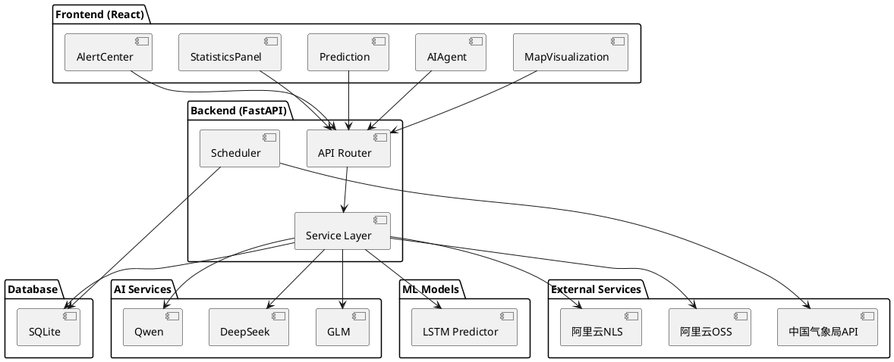

---

## 2. 时序图

### 2.1 台风预测流程

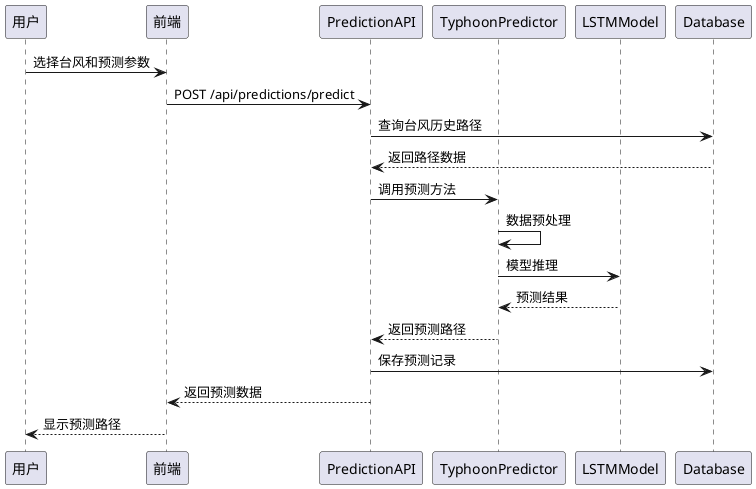

### 2.2 AI客服对话流程

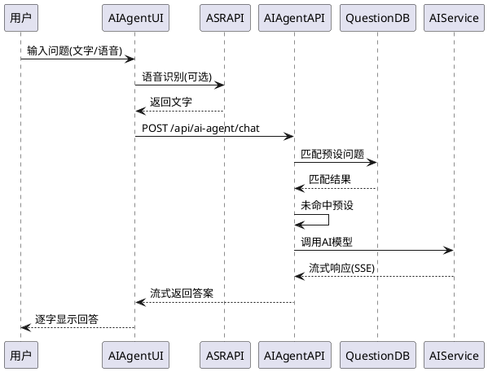

### 2.3 数据爬取流程

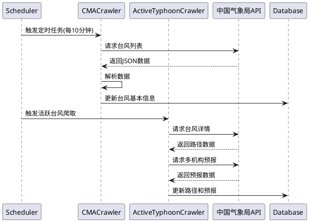

---

## 3. ER 图（数据库结构）

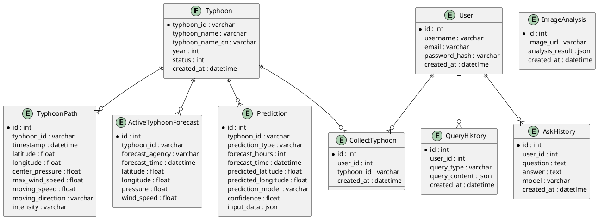

---

## 4. 用例图

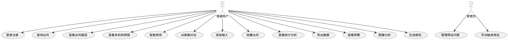

---

## 5. 活动图/流程图

### 5.1 LSTM路径预测流程

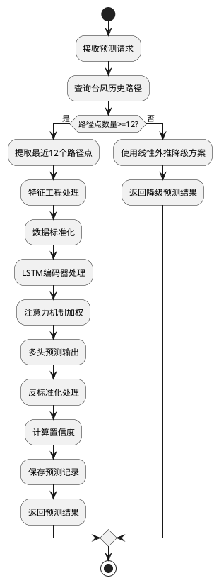

### 5.2 预警生成流程

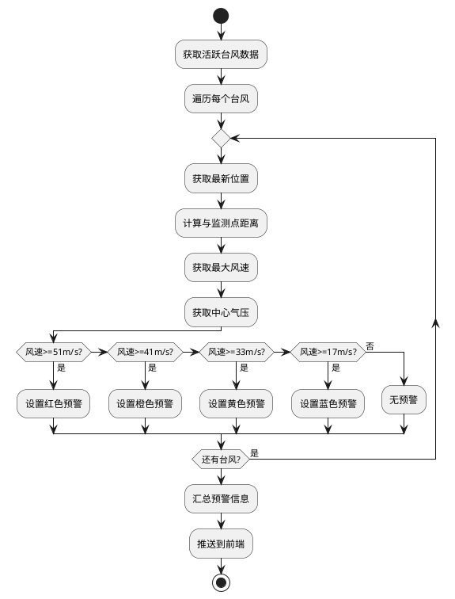

### 5.3 用户认证流程

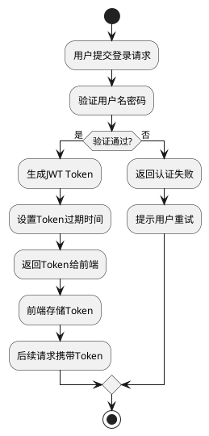

---

## 6. 类图（AI服务工厂模式）

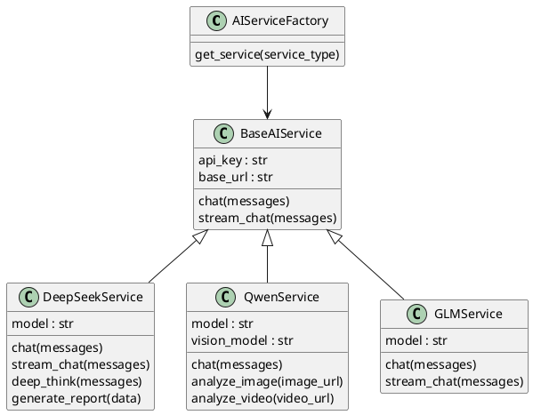

---

## 7. 思维导图（功能模块总览）

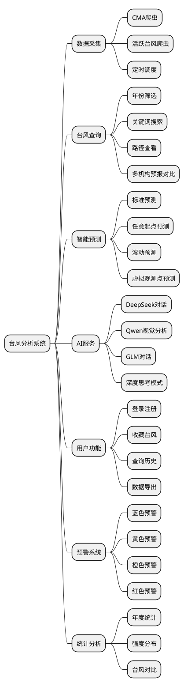

---

## 使用说明

1. 复制对应的 PlantUML 代码块（不含 ``` 标记）
2. 在飞书文档中插入画板
3. 点击「PlantUML」选项
4. 粘贴代码即可渲染

注意：所有代码均遵循飞书画板的安全子集语法，无行首缩进，无样式指令。