# TyphoonAnalysis 系统图表集

本文档包含台风分析系统的各类 PlantUML 图表，可直接复制到飞书画板使用。

---

## 1. 系统架构图（组件图）

展示前后端分离架构、数据库、AI服务、外部服务的整体关系。

```plantuml
@startuml
!define RECTANGLE class

skinparam backgroundColor #FAFAFA
skinparam componentStyle rectangle
skinparam defaultTextAlignment center

skinparam package {
BackgroundColor<<Frontend>> #E8F4FD
BackgroundColor<<Backend>> #E8F5E9
BackgroundColor<<Database>> #FFF8E1
BackgroundColor<<AI>> #F3E5F5
BackgroundColor<<External>> #FFEBEE
BackgroundColor<<ML>> #E0F7FA
BorderColor #424242
FontColor #212121
FontSize 12
FontStyle bold
}

skinparam rectangle {
BackgroundColor #FFFFFF
BorderColor #616161
BorderThickness 1.5
ArrowColor #757575
ArrowThickness 1.5
FontColor #212121
FontSize 11
RoundCorner 8
}

skinparam title {
FontSize 18
FontStyle bold
FontColor #1565C0
}

title 台风分析系统架构图

package "Frontend (React 18 + Ant Design X)" <<Frontend>> {
rectangle "Map\nVisualization" as MapViz
rectangle "Statistics\nPanel" as StatPanel
rectangle "Prediction\nPanel" as PredPanel
rectangle "Alert\nCenter" as AlertCtr
rectangle "AI Agent\nChat" as AIChat
rectangle "Image\nAnalysis" as ImgAnalysis
rectangle "Video\nAnalysis" as VidAnalysis
rectangle "Report\nGenerator" as RepGen
rectangle "User\nCenter" as UserCenter
rectangle "History\nQuery" as HistQuery
}

package "Backend (FastAPI)" <<Backend>> {
rectangle "Typhoon\nAPI" as TyAPI
rectangle "Statistics\nAPI" as StatAPI
rectangle "Prediction\nAPI" as PredAPI
rectangle "Alert\nAPI" as AlertAPI
rectangle "AI Agent\nAPI" as AIAPI
rectangle "ASR\nAPI" as ASRAPI
rectangle "Image\nAPI" as ImgAPI
rectangle "Video\nAPI" as VidAPI
rectangle "Report\nAPI" as RepAPI
rectangle "Export\nAPI" as ExportAPI
rectangle "Auth\nAPI" as AuthAPI
rectangle "Crawler\nAPI" as CrawlAPI
rectangle "Scheduler\n(APScheduler)" as Sched
}

package "Database (SQLite + SQLAlchemy Async)" <<Database>> {
rectangle "Typhoon\nData" as TyDB
rectangle "TyphoonPath\nData" as PathDB
rectangle "User\nData" as UserDB
rectangle "Prediction\nRecords" as PredDB
rectangle "AI History\n& Sessions" as AIHistDB
rectangle "Image/Video\nAnalysis" as MediaDB
rectangle "Crawler\nLogs" as LogDB
}

package "AI Services" <<AI>> {
rectangle "DeepSeek\n(deepseek-chat/r1)" as DeepSeek
rectangle "Qwen\n(qwen-max/vl-plus)" as Qwen
rectangle "GLM\n(glm-4-plus)" as GLM
rectangle "Qwen3-ASR\n(0.6B)" as QwenASR
}

package "External Services" <<External>> {
rectangle "中国气象局\n(typhoon.nmc.cn)" as CMA
rectangle "阿里云\nNLS" as NLS
}

package "ML Models (PyTorch)" <<ML>> {
rectangle "LSTM\nPredictor" as LSTM
rectangle "Advanced\nPredictor" as AdvPred
}

' Frontend to Backend
MapViz --> TyAPI : HTTP/REST
StatPanel --> StatAPI : HTTP/REST
PredPanel --> PredAPI : HTTP/REST
AlertCtr --> AlertAPI : HTTP/REST
AIChat --> AIAPI : HTTP/SSE
AIChat --> ASRAPI : HTTP/REST
ImgAnalysis --> ImgAPI : HTTP/REST
VidAnalysis --> VidAPI : HTTP/REST
RepGen --> RepAPI : HTTP/REST
UserCenter --> AuthAPI : HTTP/REST
HistQuery --> TyAPI : HTTP/REST
ExportAPI <-- StatPanel : HTTP/REST

' Backend to Database
TyAPI --> TyDB : SQLAlchemy/Async
TyAPI --> PathDB : SQLAlchemy/Async
StatAPI --> TyDB : SQLAlchemy/Async
PredAPI --> PredDB : SQLAlchemy/Async
AIAPI --> AIHistDB : SQLAlchemy/Async
ImgAPI --> MediaDB : SQLAlchemy/Async
VidAPI --> MediaDB : SQLAlchemy/Async
AuthAPI --> UserDB : SQLAlchemy/Async
CrawlAPI --> TyDB : SQLAlchemy/Async
CrawlAPI --> LogDB : SQLAlchemy/Async

' Backend to ML Models
PredAPI --> LSTM : PyTorch/CUDA
PredAPI --> AdvPred : PyTorch/CUDA

' Backend to AI Services
AIAPI --> DeepSeek : HTTPS/aiping.cn
AIAPI --> Qwen : HTTPS/aiping.cn
AIAPI --> GLM : HTTPS/aiping.cn
ASRAPI --> QwenASR : Local/HF
RepAPI --> DeepSeek : HTTPS/aiping.cn
RepAPI --> Qwen : HTTPS/aiping.cn
ImgAPI --> Qwen : HTTPS/aiping.cn
VidAPI --> Qwen : HTTPS/aiping.cn

' Scheduler to Crawler
Sched --> CrawlAPI : Internal
CrawlAPI --> CMA : HTTP/JSON

' AI Services to External
QwenASR ..> NLS : Alternative

@enduml
```

---

## 2. 时序图

### 2.1 台风路径预测流程

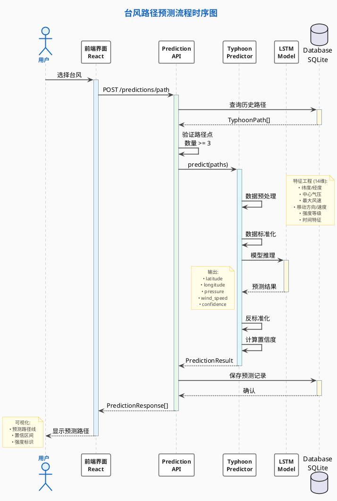

### 2.2 AI客服对话流程（含语音识别）

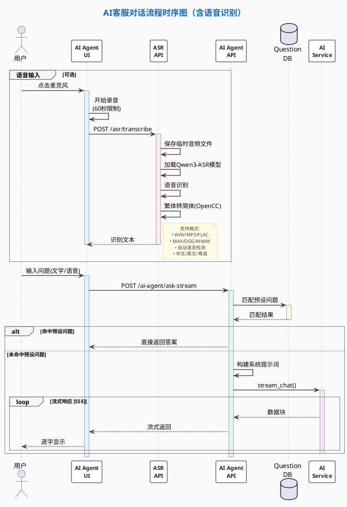

### 2.3 数据爬取流程

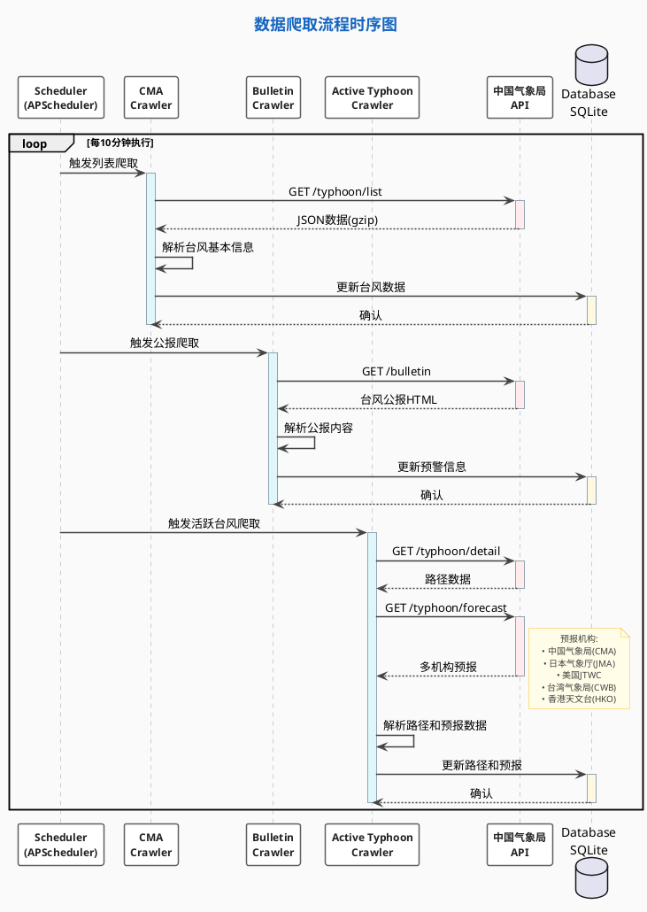

### 2.4 视频分析流程

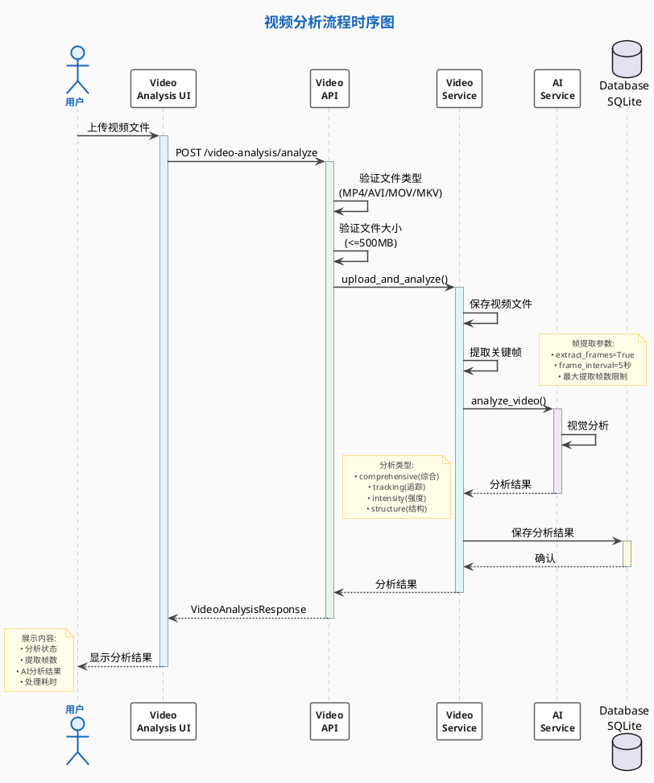

---

## 3. ER 图（数据库结构）

```plantuml
@startuml
skinparam backgroundColor #FAFAFA
skinparam defaultTextAlignment left

skinparam class {
BackgroundColor #FFFFFF
BorderColor #616161
BorderThickness 1.5
ArrowColor #757575
ArrowThickness 1.5
FontColor #212121
FontSize 11
HeaderBackgroundColor #E3F2FD
HeaderFontColor #1565C0
HeaderFontSize 12
HeaderFontStyle bold
}

skinparam title {
FontSize 18
FontStyle bold
FontColor #1565C0
}

title 台风分析系统数据库ER图

entity "Typhoon" as Typhoon {
* id : INTEGER <<PK>>
--
* typhoon_id : VARCHAR(50) <<UQ>>
* typhoon_name : VARCHAR(100)
  typhoon_name_cn : VARCHAR(100)
  year : INTEGER
  status : INTEGER [0=stop, 1=active]
}

entity "TyphoonPath" as Path {
* id : INTEGER <<PK>>
--
* typhoon_id : VARCHAR(50) <<FK>>
* timestamp : DATETIME
* latitude : FLOAT
* longitude : FLOAT
  center_pressure : FLOAT [hPa]
  max_wind_speed : FLOAT [m/s]
  moving_speed : FLOAT [km/h]
  moving_direction : VARCHAR(50)
  intensity : VARCHAR(50)
}

entity "ActiveTyphoonForecast" as Forecast {
* id : INTEGER <<PK>>
--
* typhoon_id : VARCHAR(50) <<FK>>
* forecast_agency : VARCHAR(50)
* forecast_time : DATETIME
  base_time : DATETIME
* latitude : FLOAT
* longitude : FLOAT
  center_pressure : FLOAT
  max_wind_speed : FLOAT
  power_level : INTEGER
  intensity : VARCHAR(50)
}

entity "Prediction" as Pred {
* id : INTEGER <<PK>>
--
* typhoon_id : VARCHAR(50) <<FK>>
  typhoon_name : VARCHAR(100)
  prediction_type : VARCHAR(50) [path/intensity]
  forecast_hours : INTEGER
  forecast_time : DATETIME
  predicted_latitude : FLOAT
  predicted_longitude : FLOAT
  predicted_pressure : FLOAT
  predicted_wind_speed : FLOAT
  prediction_model : VARCHAR(100)
  confidence : FLOAT
  input_data : JSON
  created_at : DATETIME
}

entity "User" as User {
* id : INTEGER <<PK>>
--
* username : VARCHAR(50) <<UQ>>
* password : VARCHAR(255)
* email : VARCHAR(100) <<UQ>>
  phone : VARCHAR(20)
  avatar_url : VARCHAR(500)
  status : INTEGER [0=禁用, 1=正常]
  created_at : DATETIME
  updated_at : DATETIME
  last_login_at : DATETIME
}

entity "CollectTyphoon" as Collect {
* id : INTEGER <<PK>>
--
* user_id : INTEGER <<FK>>
* typhoon_id : VARCHAR(50)
  typhoon_name : VARCHAR(100)
}

entity "QueryHistory" as QueryHist {
* id : INTEGER <<PK>>
--
* user_id : INTEGER <<FK>>
* typhoon_id : VARCHAR(50)
  typhoon_name : VARCHAR(100)
  query_date : DATETIME
}

entity "AskHistory" as AskHist {
* id : INTEGER <<PK>>
--
* user_id : INTEGER <<FK>>
* session_id : VARCHAR(100)
* question : TEXT
* answer : TEXT
  reasoning_content : TEXT
  is_ai_generated : INTEGER [0/1]
  ai_mode : VARCHAR(100)
  created_at : DATETIME
}

entity "TyphoonImage" as TyImg {
* id : INTEGER <<PK>>
--
  typhoon_id : VARCHAR(20)
  filename : VARCHAR(255)
  image_type : VARCHAR(50) [satellite/nwp/environment/track]
  source : VARCHAR(50) [himawari/fengyun/gfs]
  file_path : VARCHAR(500)
  file_size : INTEGER
  width : INTEGER
  height : INTEGER
  format : VARCHAR(20) [jpg/png/gif]
  capture_time : DATETIME
  upload_time : DATETIME
  latitude : FLOAT
  longitude : FLOAT
}

entity "ImageAnalysis" as ImgAnalysis {
* id : INTEGER <<PK>>
--
  typhoon_id : VARCHAR(50)
  typhoon_name : VARCHAR(100)
  image_url : VARCHAR(500)
  image_path : VARCHAR(500)
  analysis_result : TEXT
  extracted_data : JSON
  model_used : VARCHAR(100)
  created_at : DATETIME
}

entity "VideoAnalysisResult" as VidAnalysis {
* id : INTEGER <<PK>>
--
  filename : VARCHAR(255)
  analysis_type : VARCHAR(50) [comprehensive/tracking/intensity/structure]
  status : VARCHAR(20) [pending/processing/completed/failed]
  ai_analysis : JSON
  frame_count : INTEGER
  user_id : INTEGER <<FK>>
  created_at : DATETIME
  processing_time : FLOAT
  error_message : TEXT
}

entity "Report" as Report {
* id : INTEGER <<PK>>
--
  typhoon_id : VARCHAR(50)
  typhoon_name : VARCHAR(100)
  report_type : VARCHAR(50) [comprehensive/prediction/impact]
  report_content : TEXT
  model_used : VARCHAR(100)
  user_id : INTEGER <<FK>>
  related_prediction_id : INTEGER
  related_analysis_id : INTEGER
  created_at : DATETIME
}

entity "Question" as Question {
* id : INTEGER <<PK>>
--
* question : TEXT
* answer : TEXT
  weight : INTEGER
}

entity "CrawlerLog" as CrawlerLog {
* id : INTEGER <<PK>>
--
  task_type : VARCHAR(50)
  status : VARCHAR(50) [success/failed]
  message : TEXT
  data_count : INTEGER
  error_message : TEXT
  created_at : DATETIME
}

' Relationships
Typhoon ||--o{ Path : "1:N"
Typhoon ||--o{ Forecast : "1:N"
Typhoon ||--o{ Pred : "1:N"
Typhoon ||--o{ Collect : "1:N"
Typhoon ||--o{ ImgAnalysis : "1:N"

User ||--o{ Collect : "1:N"
User ||--o{ QueryHist : "1:N"
User ||--o{ AskHist : "1:N"
User ||--o{ Report : "1:N"
User ||--o{ VidAnalysis : "1:N"

@enduml
```

---

## 4. 用例图

```plantuml
@startuml
skinparam backgroundColor #FAFAFA
skinparam defaultTextAlignment center
skinparam nodesep 10
skinparam ranksep 15

' 分层布局，采用从上到下的方向
top to bottom direction

skinparam usecase {
BackgroundColor #FFFFFF
BorderColor #616161
BorderThickness 1.5
ArrowColor #757575
ArrowThickness 1.5
FontColor #212121
FontSize 8
FontStyle bold
RoundCorner 4
}

skinparam actor {
BackgroundColor #E3F2FD
BorderColor #1565C0
BorderThickness 2
FontColor #1565C0
FontSize 10
FontStyle bold
}

skinparam package {
BackgroundColor<<Auth>> #E8F4FD
BackgroundColor<<Query>> #E8F5E9
BackgroundColor<<Stats>> #FFF8E1
BackgroundColor<<Pred>> #F3E5F5
BackgroundColor<<AI>> #E0F7FA
BackgroundColor<<Alert>> #FFEBEE
BackgroundColor<<Export>> #FFF3E0
BackgroundColor<<Admin>> #F5F5F5
BorderColor #9E9E9E
BorderThickness 1
FontColor #424242
FontSize 9
FontStyle bold
}

skinparam title {
FontSize 16
FontStyle bold
FontColor #1565C0
}

skinparam rectangle {
BorderColor #616161
BorderThickness 1.5
}

title 台风分析系统用例图

actor "普通用户" as User
actor "管理员" as Admin

rectangle "台风分析系统" {

' 第一层：用户认证和台风查询
package "用户认证" <<Auth>> {
usecase (用户注册) as UC1
usecase (用户登录) as UC2
usecase (修改密码) as UC3
usecase (个人中心管理) as UC4
}

package "台风查询与可视化" <<Query>> {
usecase (查询台风列表) as UC5
usecase (查看台风详情) as UC6
usecase (查看台风路径) as UC7
usecase (多台风叠加显示) as UC8
usecase (查看多机构预报) as UC9
usecase (收藏台风) as UC10
usecase (取消收藏) as UC11
}

' 第二层：预警管理和统计分析
package "预警管理" <<Alert>> {
usecase (查看实时预警) as UC31
usecase (查看预警历史) as UC32
usecase (接收预警推送) as UC33
}

package "统计分析" <<Stats>> {
usecase (年度统计分析) as UC12
usecase (月度统计分析) as UC13
usecase (强度分布统计) as UC14
usecase (台风对比分析) as UC15
usecase (导出统计数据) as UC16
}

' 第三层：智能预测和数据导出
package "智能预测" <<Pred>> {
usecase (路径预测) as UC17
usecase (强度预测) as UC18
usecase (任意起点预测) as UC19
usecase (滚动预测) as UC20
usecase (虚拟观测点预测) as UC21
usecase (查看预测历史) as UC22
}

package "数据导出" <<Export>> {
usecase (导出台风数据CSV) as UC34
usecase (导出台风数据JSON) as UC35
usecase (批量导出数据) as UC36
}

' 第四层：AI服务和系统管理
package "AI服务" <<AI>> {
usecase (AI客服对话) as UC23
usecase (语音输入问题) as UC24
usecase (图像智能分析) as UC25
usecase (视频智能分析) as UC26
usecase (生成综合研判报告) as UC27
usecase (生成影响评估报告) as UC28
usecase (生成预测分析报告) as UC29
usecase (查看对话历史) as UC30
}

package "系统管理" <<Admin>> {
usecase (管理预设问题) as UC37
usecase (手动触发爬虫) as UC38
usecase (查看爬虫日志) as UC39
usecase (用户权限管理) as UC40
usecase (系统配置管理) as UC41
}
}

' 第一层连接
User --> UC1
User --> UC2
User --> UC3
User --> UC4
User --> UC5
User --> UC6
User --> UC7
User --> UC8
User --> UC9
User --> UC10
User --> UC11

' 第二层连接
User --> UC31
User --> UC32
User --> UC33
User --> UC12
User --> UC13
User --> UC14
User --> UC15
User --> UC16

' 第三层连接
User --> UC17
User --> UC18
User --> UC19
User --> UC20
User --> UC21
User --> UC22
User --> UC34
User --> UC35
User --> UC36

' 第四层连接
User --> UC23
User --> UC24
User --> UC25
User --> UC26
User --> UC27
User --> UC28
User --> UC29
User --> UC30

' 管理员连接
Admin --> UC37
Admin --> UC38
Admin --> UC39
Admin --> UC40
Admin --> UC41

' Include relationships
UC23 ..> UC24 : <<include>>

' 分层布局，使同一层包水平对齐
' 使用hidden lines调整布局
together {
  UC1 -[hidden]-> UC5
  UC31 -[hidden]-> UC12
  UC17 -[hidden]-> UC34
  UC23 -[hidden]-> UC37
}
@enduml
```

---

## 5. 活动图/流程图

### 5.1 LSTM路径预测流程

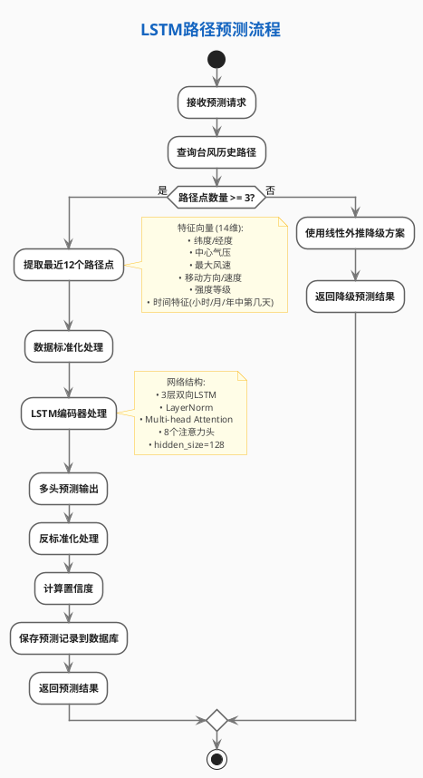

### 5.2 预警生成流程

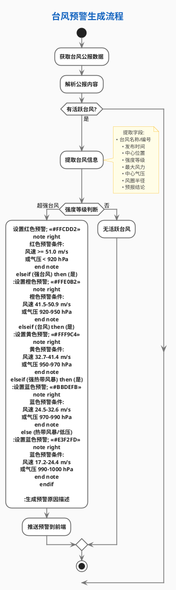

### 5.3 用户认证流程

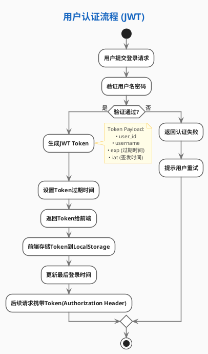

### 5.4 AI报告生成流程

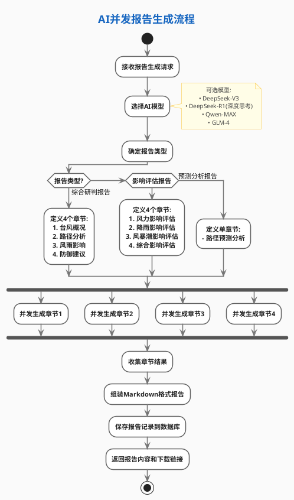

### 5.5 语音识别流程

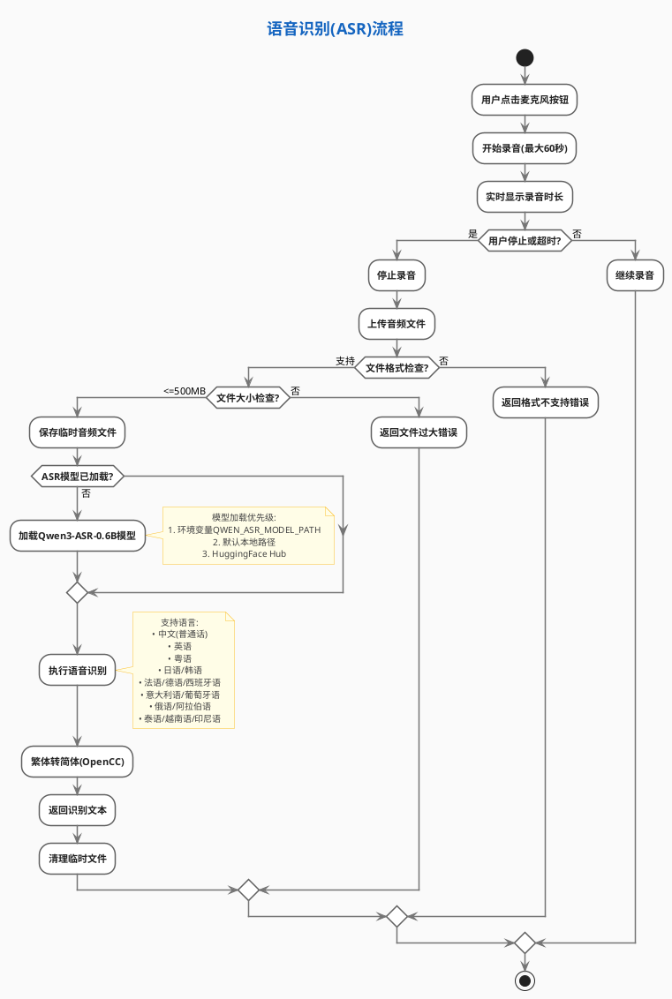

---

## 6. 类图（AI服务工厂模式）

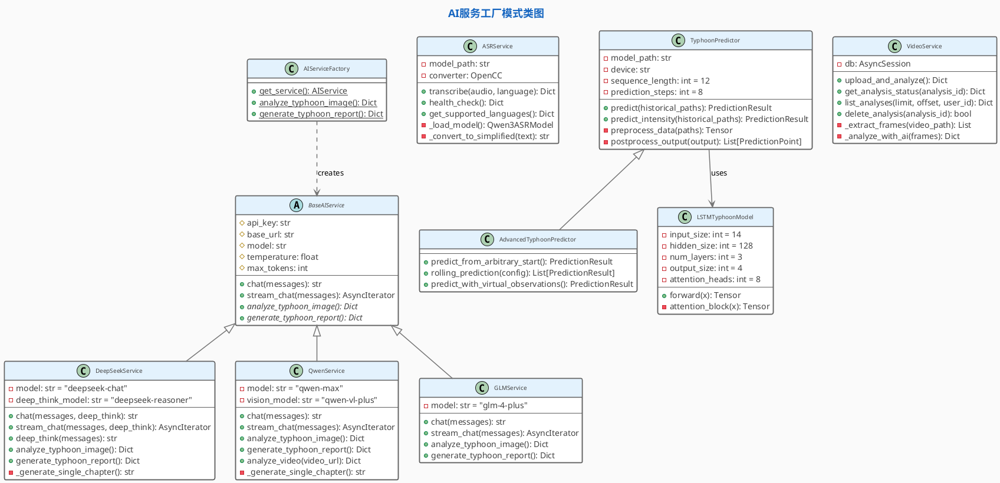

---

## 7. 思维导图（功能模块总览）

```plantuml
@startmindmap
skinparam backgroundColor #FAFAFA

' 根节点样式
skinparam nodeRoot {
BackgroundColor #1565C0
FontColor #FFFFFF
FontSize 16
FontStyle bold
}

' 一级节点样式
skinparam nodeLevel1 {
BackgroundColor #E3F2FD
FontColor #1565C0
FontSize 14
FontStyle bold
}

' 二级节点样式
skinparam nodeLevel2 {
BackgroundColor #E8F5E9
FontColor #2E7D32
FontSize 12
FontStyle bold
}

' 三级节点样式
skinparam nodeLevel3 {
BackgroundColor #FFF8E1
FontColor #F57C00
FontSize 11
}

' 四级节点样式
skinparam nodeLevel4 {
BackgroundColor #FFFFFF
FontColor #424242
FontSize 10
}

* 台风分析系统
** 数据采集
*** CMA爬虫
**** 台风列表爬取
**** 历史路径数据
**** 多机构预报
*** 公报爬虫
**** 台风公报解析
**** 预警信息提取
*** 活跃台风爬虫
**** 实时路径更新
**** 预报数据更新
*** 定时调度器
**** 10分钟间隔
**** 任务队列管理
**** 失败重试机制

** 台风查询与可视化
*** 年份筛选(2000-2026)
*** 关键词搜索
*** 路径可视化
**** 历史路径(实线/强度着色)
**** 预报路径(虚线)
**** 多台风叠加显示
**** 警戒线显示(24h/48h)
**** 风圈半径展示
*** 多机构预报对比
**** 中国气象局(CMA)
**** 日本气象厅(JMA)
**** 美国JTWC
**** 台湾气象局(CWB)
**** 香港天文台(HKO)
*** 实时路径点详情
**** 时间/位置
**** 气压/风速
**** 移动速度/方向
**** 强度等级

** 智能预测
*** 标准路径预测
**** 基于Transformer+LSTM
**** 支持24/48/72小时
**** 集成预测模式
**** 置信度评估
*** 强度预测
**** 气压预测
**** 风速预测
*** 任意起点预测
**** 自定义起始坐标
**** 假设情景分析
*** 滚动预测
**** 连续多步预测
**** 稳定性评估
*** 虚拟观测点预测
**** 模拟转向场景
**** 多机构预报对比
*** 预测可视化
**** 预测路径线
**** 置信区间
**** 历史对比

** AI服务
*** DeepSeek对话
**** 标准模式(V3)
**** 深度思考模式(R1)
**** 流式响应
*** Qwen视觉分析
**** 图像分析(qwen-vl-max)
**** 视频分析
**** 卫星云图识别
*** GLM对话
**** 标准对话(glm-4-plus)
**** 流式响应
*** 语音识别(Qwen3-ASR)
**** 本地模型部署
**** 支持15种语言
**** 自动繁简转换
**** 音频格式转换
*** 报告生成
**** 综合研判报告
**** 影响评估报告
**** 预测分析报告
**** 并发章节生成
**** Markdown导出

** 用户功能
*** 登录注册
**** JWT认证
**** Token过期管理
*** 个人中心
**** 修改个人信息
**** 修改密码
**** 头像上传
*** 收藏台风
**** 添加收藏
**** 取消收藏
**** 收藏列表
*** 查询历史
**** 台风查询记录
**** AI对话历史
**** 会话管理
*** 数据导出
**** CSV格式导出
**** JSON格式导出
**** 批量导出(最多50个)
**** 含/不含路径数据

** 预警系统
*** 实时预警
**** 台风公报解析
**** 自动预警生成
**** 预警级别判断
*** 预警级别
**** 蓝色预警(热带风暴)
**** 黄色预警(强热带风暴)
**** 橙色预警(台风)
**** 红色预警(强/超强台风)
*** 预警历史
**** 历史预警查询
**** 预警状态跟踪
**** 时间范围筛选

** 统计分析
*** 年度统计
**** 年度台风数量
**** 年度趋势分析
*** 月度统计
**** 月度分布
**** 季节性分析
*** 强度分布
**** 强度等级饼图
**** 强度趋势
*** 台风对比
**** 多台风对比
**** 路径对比
**** 强度对比
*** 数据可视化
**** ECharts图表
**** 折线图/柱状图/饼图
**** 交互式图表

** 图像/视频分析
*** 图像分析
**** 卫星云图上传
**** 多种分析模式
**** AI特征提取
*** 视频分析
**** 视频上传(MP4/AVI等)
**** 关键帧提取
**** 视频内容分析
**** 分析状态跟踪

@endmindmap
```

---

## 8. 部署架构图

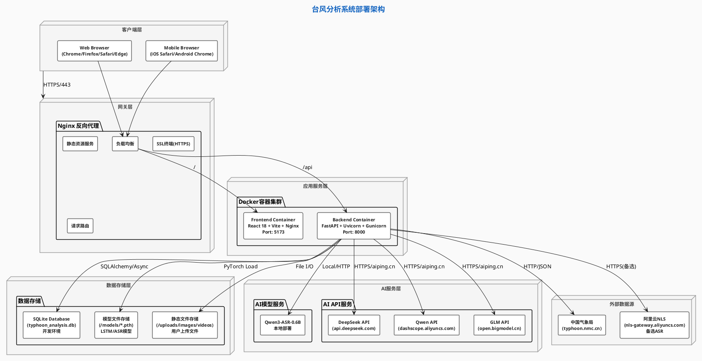

---

## 使用说明

1. 复制对应的 PlantUML 代码块（不含 ``` 标记）
2. 在飞书文档中插入画板
3. 点击「PlantUML」选项
4. 粘贴代码即可渲染

### 图表优化说明

本次优化对图表进行了全面的内容补充和样式改进：

#### 1. 内容完整性补充

根据 README.md 和实际代码，补充了以下缺失内容：

- **语音识别模块 (ASR)**：Qwen3-ASR 本地部署、15种语言支持、繁简转换
- **视频分析模块**：视频上传、关键帧提取、AI分析
- **公报爬虫**：台风公报解析、预警信息提取
- **数据导出**：CSV/JSON格式、批量导出功能
- **用户中心**：个人中心管理、查询历史、收藏功能
- **统计分析**：年度/月度/强度分布、台风对比

#### 2. 架构图更新

- 补充了 ASR API、Video API、Export API 等缺失的API模块
- 添加了 Qwen3-ASR 本地模型服务
- 完善了数据库实体（TyphoonImage、VideoAnalysisResult、CrawlerLog）
- 更新了技术栈版本（React 18 + Ant Design X、FastAPI）

#### 3. 时序图补充

- 新增语音识别流程时序图
- 新增视频分析流程时序图
- 补充了公报爬虫到数据爬取流程
- 完善了AI服务调用细节（aiping.cn统一接口）

#### 4. ER图完善

- 补充了 TyphoonImage 实体（图像元数据）
- 补充了 VideoAnalysisResult 实体
- 补充了 CrawlerLog 实体
- 完善了字段注释和数据类型

#### 5. 用例图扩展

- 从原来的29个用例扩展到41个用例
- 细化了用户认证、数据导出、系统管理等模块
- 补充了语音输入、视频分析等AI功能用例

#### 6. 活动图新增

- 新增语音识别流程活动图
- 完善了预警生成流程（基于公报数据）
- 补充了模型加载优先级说明

#### 7. 类图更新

- 添加了 ASRService 类
- 添加了 VideoService 类
- 更新了模型路径和配置参数

#### 8. 思维导图扩展

- 大幅扩展了功能模块细节
- 补充了数据采集、AI服务、图像/视频分析等模块
- 完善了各功能的子功能点

#### 9. 部署架构图更新

- 细化了容器配置（端口、技术栈）
- 补充了AI服务层的分层（本地模型+API服务）
- 完善了数据存储层的说明

注意：所有代码均遵循飞书画板的安全子集语法，无行首缩进，无样式指令。
